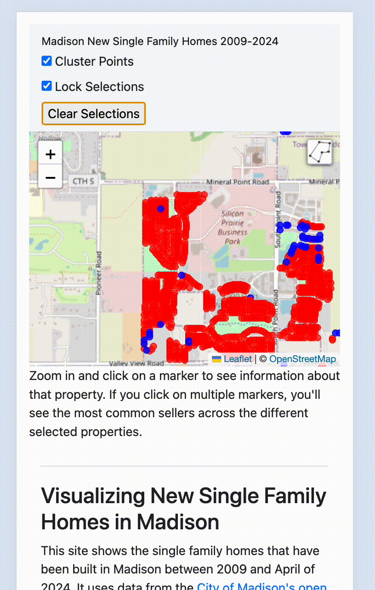
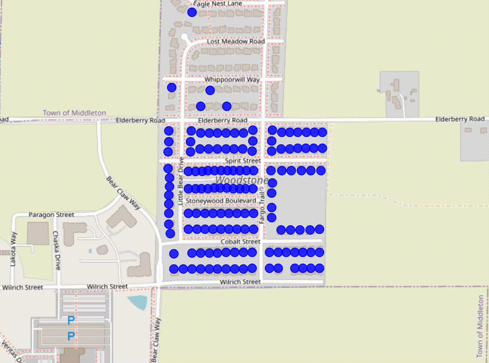

<h3 style="margin-top: 20px;">Visualizing New Single Family Homes in Madison</h3>
    <h4>See the accompanying blog post <a href="https://posts.unit1127.com/p/creating-new-single-family-homes-veridian">here</a></h4>
    
This site shows the single family homes that have been built in Madison between 2009 and April of 2024. 
        It uses data from the <a href="https://data-cityofmadison.opendata.arcgis.com/">City of Madison's open data portal</a> and the <a href="https://www.cityofmadison.com/assessor/">Assessor's Office.</a> 
    

    
Notably, it uses sales history to decide if the property was developed by <a href=https://veridianhomes.com/">Veridian Homes.</a> 
    Veridian homes are marked in red, and non-Veridian homes are marked in Blue.

    

Because Veridian, like nearly all developers, typically uses a number of LLCs to develop different properties, it is sometimes not immediately obvious if Veridian was the developer behind a project. 
To decide if Veridian was the developer, I used data collected by <a href="https://law.marquette.edu/facultyblog/2024/03/landlords-use-many-different-llcs-a-new-tool-mkepropertyownership-com-connects-them/">John D. Johnson at the Marquette University Lubar Center</a> originally from the Wisconsin Department of Financial Institutions to compare different LLCs. 
Because I was only looking for Veridian I did not do an as extensive analysis as John did, and simply compared addresses for Veridian LLCs rather than building out a full ownership network.

The takeaway is that of the 4,146 single family homes built since 2009, Veridian has built 2823 of them, and all other developers and individuals combined built the remaining 1323.
That's 68% of all new single family homes in Madison since 2009, making Veridian far and away the biggest player in this market.

For this work, I took everything the Assessor classified as 'Single family' in the 'PropertyUse' field. Note that some of what the assessor calls a single family home might not be what most people call a single family home, depending on how you want to think about duplexes. Here's the full breakdown.

<table>
    <tr>
        <th>HomeStyle</th>
        <th>Count</th>
    </tr>
    <tr>
        <td>Modern two story</td>
        <td>2457</td>
    </tr>
    <tr>
        <td>Ranch</td>
        <td>1194</td>
    </tr>
    <tr>
        <td>Colonial</td>
        <td>134</td>
    </tr>
    <tr>
        <td>Townhouse Duplex</td>
        <td>127</td>
    </tr>
    <tr>
        <td>Ranch Duplex</td>
        <td>77</td>
    </tr>
    <tr>
        <td>Townhouse</td>
        <td>57</td>
    </tr>
    <tr>
        <td>Contemporary</td>
        <td>29</td>
    </tr>
    <tr>
        <td>Bungalow</td>
        <td>24</td>
    </tr>
    <tr>
        <td>Cape Cod</td>
        <td>12</td>
    </tr>
    <tr>
        <td>Bi-level</td>
        <td>9</td>
    </tr>
    <tr>
        <td>Split-level</td>
        <td>7</td>
    </tr>
    <tr>
        <td>Old Style</td>
        <td>5</td>
    </tr>
    <tr>
        <td>Other</td>
        <td>4</td>
    </tr>
    <tr>
        <td>New style modern international</td>
        <td>4</td>
    </tr>
    <tr>
        <td>Victorian georgian regency</td>
        <td>3</td>
    </tr>
    <tr>
        <td>Tudor</td>
        <td>2</td>
    </tr>
    <tr>
        <td>Townhouse End Unit</td>
        <td>1</td>
    </tr>
</table>

<h3>Tips on how to use the app</h3>
<h4>Lock and Unlock Selections</h4>
If you click on a property, it will be selected. If you click on another property, it will be added to the selection.
If you click on an already selected property it will be unselected. 
If the 'Lock Selections' checkbox is checked, the selection set stays selected even if you click somewhere else on the map.
This is especially helpful on mobile because it's easier to miss when touching locations. 
If you turn off 'Lock Selections' you can clear all selected properties just by clicking anywhere on the map. 
If you have 'Lock Selections' on, you can clear all selected properties by clicking the 'Clear Selections' button.

<h4>Select by polygon (useful for mobile)</h4>

Click on the polygon icon on the upper right corner of the map. 
Click on the map to place your corners. When you're done, click on the green box to close the polygon.
Adjust the polygon if you'd like by clicking on the white squares. 
To add a new segment, click on the light grey squares.
When you've got the polygon you want, click in the middle of the polygon to finish the adjustments.
Then double-click in the middle of the polygon to confirm the selection.

<h4 style="margin-top: 30px;">Shift-drag to select (desktop only)</h4>

If you're on a desktop, you can hold down the shift key and drag a box to select multiple properties at once.

<h3 style="margin-top: 30px;">Credits</h3>

This site was created by <a href="http://twitter.com/erik_paulson">Erik Paulson</a> and is built with <a href="https://leafletjs.com/">Leaflet</a> along with the <a href="https://github.com/Leaflet/Leaflet.markercluster">Leaflet.markercluster</a> and <a href="https://github.com/bopen/leaflet-area-selection">Leaflet Area Selection</a> plugins.
Thanks to the Megan Lukas from the Assessor's office and Dan McAullife from Planning for their help with the data. 

    
